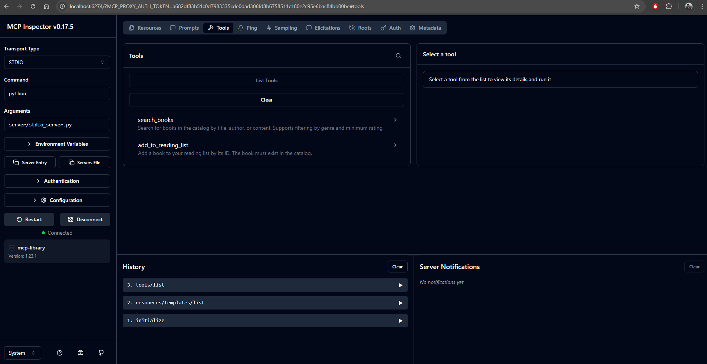

# Getting Started with MCP Library

This guide walks you through using the MCP Book Library from scratch.

## Step 1: Environment Setup

### Install Python Dependencies

```bash
# Create virtual environment (recommended)
python -m venv venv
source venv/bin/activate  # On Windows: venv\Scripts\activate

# Install packages
pip install -r requirements.txt
```

### Install and Start Ollama

1. Download from [ollama.ai](https://ollama.ai/download)
2. Install for your operating system
3. Start the service:
   ```bash
   ollama serve
   ```
4. Pull the model (in another terminal):
   ```bash
   ollama pull llama3
   ```

## Step 2: Verify Installation 

```bash
# Test that Ollama is running
ollama list

# Should show llama3 in the list

#In case ollama does not start up
ollama run llama3 --keepalive 60m 
```

## Step 3: Run Your First MCP Server 

```bash
# Start the STDIO server
python server/stdio_server.py
```

You should see the server waiting for input (it communicates via stdin/stdout).
Press `Ctrl+C` to stop.

## Step 4: Use the Interactive Assistant 

```bash
# Start the Ollama host
python host/run_ollama.py
```

Try these commands: 
#### ***Note***: Please be patient, your laptop is generally not very fast in processing a locally running models.

```
You: Hello
Assistant: [Greeting]

You: What books do you have about science fiction?
Assistant: [Uses search_books tool to find sci-fi books]

You: Recommend me a book based on my reading history
Assistant: [Uses recommend_books prompt with your data]

You: Add The Hobbit to my reading list
Assistant: [Uses add_to_reading_list tool]

You: exit
```

## Step 5: Explore with MCP Inspector 

### Install Inspector

```bash
npm install -g @modelcontextprotocol/inspector
```

### Launch Inspector

```bash
mcp-inspector python server/stdio_server.py
```



This opens a web interface (usually http://localhost:5173).

### Test Resources

1. Click **"Resources"** tab
2. Click on `library://books/catalog`
3. See all 10 books with full metadata

### Test Prompts

1. Click **"Prompts"** tab
2. Select `recommend_books`
3. Add arguments:
   - genre: "Fantasy"
   - mood: "epic"
4. Click **"Get Prompt"**
5. See the full template with injected data

### Test Tools

1. Click **"Tools"** tab
2. Select `search_books`
3. Enter arguments:
   ```json
   {
     "query": "dystopian",
     "min_rating": 4.0
   }
   ```
4. Click **"Call Tool"**
5. See search results!

## Step 6: Understand the Code (15 minutes)

### Resources (server/resources/)

Resources are data sources. Look at `book_catalog.py`:

```python
def get_book_catalog():
    # Loads books.json and returns it as an MCP resource
    # LLMs can read this to know what books exist
```

**Key concept**: Resources are READ-ONLY. They provide context.

### Prompts (server/prompts/)

Prompts are templates. Look at `prompt_templates.py`:

```python
def get_recommend_books_prompt(genre, mood):
    # Fetches reading_stats and book_catalog
    # Injects them into a recommendation template
    # Returns instructions for the LLM
```

**Key concept**: Prompts fetch resources internally and create structured instructions.

### Tools (server/tools/)

Tools are actions. Look at `library_tools.py`:

```python
def search_books(query, genre, min_rating):
    # Searches books.json
    # Returns matching books
    
def add_to_reading_list(book_id):
    # Modifies reading_list.json on disk
    # Returns success/failure
```

**Key concept**: Tools EXECUTE and can MODIFY data.

## Step 7: How LLM Routing Works (10 minutes)

Open `host/run_ollama.py` and follow the flow:

### System Context Building
```python
async def get_system_context(self):
    # Fetches ALL available tools and prompts
    # Builds a system prompt describing each one
    # LLM reads this to know what it can do
```

### The Agent Loop
```python
while iteration < max_iterations:
    # Send user query + system context to Ollama
    response = ollama.chat(messages=messages)
    
    # Parse if LLM wants to use a tool
    action = self.parse_llm_response(response)
    
    if action:
        # Execute the tool/prompt
        result = await self.execute_tool(...)
        
        # Feed result back to LLM
        # LLM can chain multiple tools!
    else:
        # No action = final answer
        return response
```

**Key concept**: NO `if user_input.contains("search")` logic!
The LLM reads tool descriptions and decides what to use.

## Step 8: Run Tests (5 minutes)

```bash
# Run all tests
pytest tests/ -v

# Run specific test file
pytest tests/test_tools.py -v

# Run with output
pytest tests/ -v -s
```

Tests verify:
- Resources return correct JSON structure
- Prompts inject data properly
- Tools execute and persist data
- Search filters work correctly

## Step 9: Experiment! (∞ minutes)

### Add a New Book

Edit `server/data/books.json`:

```json
{
  "id": "neuromancer",
  "title": "Neuromancer",
  "author": "William Gibson",
  "year": 1984,
  "genre": "Cyberpunk",
  "pages": 271,
  "rating": 4.2,
  "summary": "A hacker is hired for one last job in cyberspace."
}
```

Restart the server and search for "cyberpunk"!

### Create a New Tool

Add to `server/tools/library_tools.py`:

```python
def rate_book(book_id: str, rating: float) -> dict:
    \"\"\"Add a user rating to a book.\"\"\"
    # Implementation here
    pass
```

Register in `server/registry.py` and test!

### Build a New Prompt

Add to `server/prompts/prompt_templates.py`:

```python
def get_reading_challenge_prompt() -> dict:
    \"\"\"Create a monthly reading challenge.\"\"\"
    # Fetch stats, suggest diverse books
    pass
```

## Common Workflows

### Workflow 1: Search → Add to List
```
User: "Find books by Tolkien and add The Hobbit to my list"

LLM: 
  1. Uses search_books(query="tolkien")
  2. Sees results
  3. Uses add_to_reading_list(book_id="hobbit")
  4. Confirms to user
```

### Workflow 2: Stats → Recommendations
```
User: "What should I read next?"

LLM:
  1. Uses recommend_books prompt (fetches stats automatically)
  2. Analyzes user's reading history
  3. Provides personalized suggestions
```

## Troubleshooting

### "Server not found"
```bash
# Make sure you're in the project root
pwd  # Should show .../mcp-library

# Server path should be relative
python server/stdio_server.py
```

### "Ollama model not found"
```bash
# Pull the model
ollama pull llama3

# Verify it's there
ollama list
```

### "Permission denied writing to reading_list.json"
```bash
# Check file permissions
ls -l server/data/reading_list.json

# Fix if needed
chmod 644 server/data/reading_list.json
```

## Next Steps

1. ✅ Try all 3 prompts with different arguments
2. ✅ Search with various filters (genre, rating)
3. ✅ Add 5 books to your reading list
4. ✅ Read the architecture diagram in `diagrams/`
5. ✅ Modify a tool and see how the LLM uses it
6. ✅ Build your own custom MCP server!

## Need Help?

- Check `README.md` for architecture overview
- See `client/inspector_guide.md` for detailed Inspector usage
- Read the code comments - they explain WHY things work
- Review `diagrams/` for visual system understanding

---

**You're ready to build with MCP! **